# 🧠 MemState

[](https://pypi.org/project/memstate/)
[](https://pypi.org/project/memstate/)
[](https://github.com/scream4ik/MemState/blob/main/LICENSE)
[](https://github.com/scream4ik/MemState/actions)
<!-- [](https://pepy.tech/project/memstate) -->

**The "Git" for AI Agent Memory.**
Transactional, type-safe state management with rollbacks for LangGraph & LangChain agents.

---

## ⚡ Why MemState?

Most agent memory systems today are just wrappers around Vector DBs. This leads to:
*   **Hallucinations:** The agent retrieves two contradictory facts (e.g., "User likes cats" vs "User hates cats") and guesses.
*   **State Corruption:** No validation. Agents overwrite critical data (like IDs or balances) with garbage.
*   **No Undo Button:** If an agent makes a mistake, you can't roll back the state. You have to wipe the memory.

**MemState is different.** It treats Agent Memory like a Database, not a text dump.

---

## ✨ Key Features

*   **🛡️ Type-Safe:** Uses `Pydantic` schemas. If an agent tries to save a string into an `age: int` field, it fails *before* corruption happens.
*   **⏪ Time Travel:** Every change is a transaction. You can `rollback(steps=1)` to undo an agent's mistake instantly.
*   **🔒 Constraints:** Enforce logic like "One User Profile per Email" (`Singleton`). No more duplicate profiles.
*   **🔌 Hybrid Hooks:** Use MemState as the Source of Truth and automatically sync to Vector DBs (Chroma, Qdrant) via hooks.
*   **🔍 JSON Querying:** Fast, structured search (`WHERE role = 'admin'`) via SQLite JSON1 extension. No need to embed everything.

---

## 🏗 Architecture

```mermaid
flowchart LR
    User[User] -->|Input| Agent[AI Agent]
    Agent -->|1. Commit Fact| Mem{MemState}

    subgraph Core [Logic Layer]
        direction TB
        Schema[🛡️ Pydantic Schema]
        Const[🔒 Constraints]
        Log[📝 Tx Log]
    end

    Mem --> Schema --> Const --> Log

    Log -->|2. Persist| DB[(Database)]
    Log -.->|3. Sync Hook| Vec[(Vector DB)]
```



---

## 🚀 Quick Start

### Installation
```bash
pip install memstate
```

For Redis support
```bash
pip install memstate[redis]
```

For LangGraph support
```bash
pip install memstate[langgraph]
```

### Basic Usage

```python
from memstate.storage import MemoryStore, Fact, Constraint
from memstate.backends.sqlite import SQLiteStorage
from pydantic import BaseModel

# 1. Define what your agent is allowed to remember
class UserProfile(BaseModel):
    username: str
    level: int = 1

# 2. Initialize Storage (SQLite)
storage = SQLiteStorage("agent_brain.db")
memory = MemoryStore(storage)

# 3. Register Schema with Rules
# Rule: "username" must be unique. If it exists, UPDATE it (don't duplicate).
memory.register_schema("user", UserProfile, Constraint(singleton_key="username"))

# 4. Commit a Fact (Transactional)
user_fid = memory.commit(
    Fact(type="user", payload={"username": "neo", "level": 99}),
    actor="Agent_Smith"
)

# 5. Agent makes a mistake? Rollback!
memory.update(fact_id=user_fid, patch={"payload": {"level": 0}})  # Oops
print("Before rollback:", memory.query(typename="user")[0]['payload'])

memory.rollback(1)
print("After rollback:", memory.query(typename="user")[0]['payload'])
# Level is back to 99.
```

### Using with LangGraph

MemState includes a native checkpointer that persists your agent's graph state to SQLite/Redis.

```python
from memstate.integrations.langgraph import MemStateCheckpointer
from memstate.storage import MemoryStore
from memstate.backends.sqlite import SQLiteStorage

# Initialize
storage = SQLiteStorage("agent_brain.db")
memory = MemoryStore(storage)
checkpointer = MemStateCheckpointer(memory=memory)

# Compile your graph
app = workflow.compile(checkpointer=checkpointer)

# Run with thread_id - state is automatically saved!
config = {"configurable": {"thread_id": "session_1"}}
inputs = "I would like to order pizza."
app.invoke(inputs, config=config)
```

---

## 💡 Use Cases

### 1. Financial & Legal Bots (Compliance)
**Problem:** An LLM hallucinates a loan interest rate.
**Solution:** Use `Immutable` constraints for signed contracts. Use `Transaction Logs` to audit exactly *when* and *why* a fact was changed.

### 2. RPGs & Interactive Fiction
**Problem:** The player picked up a key, used it, then lost it. The LLM forgets the door is now unlocked.
**Solution:** Use MemState to track the World State (`door_status: open`). If the player dies, use `rollback()` to reset the state to the last checkpoint perfectly.

### 3. Form Filling (Slot Filling)
**Problem:** User corrects themselves ("My car is a BMW... wait, no, an Audi"). Vector DBs return both.
**Solution:** Use `Singleton` constraint on `car_model`. The correction automatically overwrites the old fact. The agent only sees the latest truth.

---

## 📂 Demos

Check the [examples/](https://github.com/scream4ik/MemState/tree/main/examples) folder for runnable scripts:

1.  **[examples/main_demo.py](https://github.com/scream4ik/MemState/blob/main/examples/main_demo.py)**
    *   Full tour: Schemas, Singletons, Hallucination Correction via Rollback.

2.  **[examples/rag_hook_demo.py](https://github.com/scream4ik/MemState/blob/main/examples/rag_hook_demo.py)**
    *   **Hybrid Memory Pattern.**
    *   Shows how to use MemState as the "Master DB" that automatically syncs text to a mock Vector DB for RAG.
    *   Demonstrates automatic cleanup: Delete a fact in SQL -> It vanishes from Vectors.

3.  **[examples/langgraph_checkpoint_demo.py](https://github.com/scream4ik/MemState/blob/main/examples/langgraph_checkpoint_demo.py)**
    *   **LangGraph Persistence (Zero-config).**
    *   Shows how to plug `MemStateCheckpointer` into a LangGraph workflow.
    *   Demonstrates pausing, resuming, and persisting agent threads to database.
    *   *Runs locally without API keys.*

4.  **[examples/pizza_agent_demo.py](https://github.com/scream4ik/MemState/blob/main/examples/pizza_agent_demo.py)**
    *   **Advanced Stateful Agent.**
    *   A "Pizza Ordering" agent that separates Chat History from Business State (the JSON order).
    *   **Resilience:** Simulate a server crash and resume the order exactly where you left off.
    *   **Audit:** Shows how to query the SQL log to see exactly when the user changed "Pepperoni" to "Mushrooms".

---

## 🛠 Status
**Alpha / MVP.**
Ready for local development.

Supports: `InMemoryStorage`, `RedisStorage`, `SQLiteStorage`.

Planned: `PostgresStorage`.

---

## 📄 License

Licensed under the [Apache 2.0 License](LICENSE).

---

## 🤝 Contributing

Issues and PRs welcome. See [CONTRIBUTING.md](CONTRIBUTING.md) for details.

---

## ⭐️ Like the idea?

Star the repo and share feedback — we’re building in the open.
