# 🧠 MemState

[](https://pypi.org/project/memstate/)
[](https://pypi.org/project/memstate/)
[](https://github.com/scream4ik/MemState/blob/main/LICENSE)
[](https://github.com/scream4ik/MemState/actions)

**ACID-like Memory for AI Agents.**
Atomically syncs Pydantic models & Vector DBs with Git-style versioning.

---

## ⚡ Why MemState?

Building agents is easy. Keeping their state consistent is hard.

Most memory systems are just wrappers around Vector DBs or JSON files. This leads to **Data Drift**:
*   **Split Brain:** The agent updates a User Profile in SQL, but the Vector DB still holds the old embedding. Result: Hallucinations.
*   **Dirty Reads:** A complex chain fails halfway, leaving the memory in a broken, partial state.
*   **No Undo:** If an agent overwrites critical context, you can't hit "Ctrl+Z".

**MemState brings database semantics to Agent Memory:**
*   **⚛️ Atomicity:** Changes to Structured Data (SQL) and Semantic Data (Vectors) happen together or not at all.
*   **🛡️ Isolation:** Changes in a session are invisible to the main memory until `committed`.
*   **⏪ Time Travel:** Built-in history log allows you to rollback an agent's state to any point in time.

---

## ✨ Key Features

*   **⚡ Real-time RAG Sync:** Automatically upserts/deletes vectors in **ChromaDB** when you commit facts. No more manual sync logic.
*   **🛡️ Type-Safe:** Uses `Pydantic` schemas. If an agent tries to save a string into an `age: int` field, it fails *before* corruption happens.
*   **⏪ Git-like Versioning:** Every change is a transaction. `rollback(steps=1)` undoes the last action instantly.
*   **🔒 Constraints:** Enforce logic like "One User Profile per Email" (`Singleton`). No more duplicate profiles.
*   **🔌 Pluggable Backends:** SQLite, Redis, In-Memory.

---

## 🏗 Architecture

```mermaid
flowchart LR
    User[User] -->|Input| Agent[AI Agent]
    Agent -->|1. Commit Fact| Mem{MemState}

    subgraph Core [ACID Layer]
        direction TB
        Schema[🛡️ Pydantic Schema]
        Log[📝 Tx Log]
    end

    Mem --> Schema --> Log

    Log -->|2. Atomic Write| DB[(SQLite/Redis)]
    Log -.->|3. Auto-Sync| Vec[(ChromaDB)]
```



---

## 🚀 Quick Start

### Installation

```bash
pip install memstate
```

For **ChromaDB** support (RAG Sync):
```bash
pip install memstate[chromadb]
```

For **LangGraph** support:
```bash
pip install memstate[langgraph]
```

For **Redis** support:
```bash
pip install memstate[redis]
```

---

### 1. Basic Usage (Structured Memory)

```python
from memstate import MemoryStore, Constraint, Fact, SQLiteStorage
from pydantic import BaseModel

# 1. Define schema
class UserProfile(BaseModel):
    username: str
    level: int = 1

# 2. Initialize Storage
storage = SQLiteStorage("agent_brain.db")
memory = MemoryStore(storage)
memory.register_schema("user", UserProfile, Constraint(singleton_key="username"))

# 3. Commit a Fact (Transactional)
user_fid = memory.commit(
    Fact(type="user", payload={"username": "neo", "level": 99}),
    actor="Agent_Smith"
)

# 4. Rollback (Time Travel)
memory.update(fact_id=user_fid, patch={"payload": {"level": 0}})  # Mistake
memory.rollback(1)  # Level is back to 99
```

### 2. Automatic RAG Sync (ChromaDB)

MemState ensures your Vector DB always matches your Structured DB.

```python
import chromadb
from memstate.integrations.chroma import ChromaSyncHook

# 1. Setup Chroma Client
chroma_client = chromadb.Client()

# 2. Create the Hook
# This tells MemState: "When data changes, put 'content' field into Chroma"
rag_hook = ChromaSyncHook(
    client=chroma_client,
    collection_name="agent_memory",
    text_field="content",             # Field to embed
    metadata_fields=["role", "topic"] # Fields to filter by
)

# 3. Attach to Memory
memory = MemoryStore(storage)
memory.add_hook(hook=rag_hook)

# 4. That's it!
# When you commit, it automatically upserts to Chroma.
memory.commit(
    Fact(type="memory", payload={"content": "The sky is blue", "topic": "nature"})
)

# Verify in Chroma
coll = chroma_client.get_collection("agent_memory")
print(coll.get()['documents'])  # ['The sky is blue']
```

### 3. Using with LangGraph

MemState includes a native checkpointer that persists your agent's graph state.

```python
from memstate.integrations.langgraph import MemStateCheckpointer

checkpointer = MemStateCheckpointer(memory=memory)
# Compile your graph
app = workflow.compile(checkpointer=checkpointer)
```

---

## 💡 Use Cases

### 1. Hybrid Search (The "Holy Grail")
**Problem:** User asks "Who is the admin?". Vector search fails because "admin" isn't semantically close to a name.
**Solution:** MemState keeps structured data structured.
*   Use **SQL** for precise queries: `memory.query(role="admin")`.
*   Use **Vector** for fuzzy queries: `chroma.query("What do we know about cats?")`.
*   Both are always in sync.

### 2. Financial & Legal Bots (Compliance)
**Problem:** An LLM hallucinates a loan interest rate.
**Solution:** Use `Immutable` constraints for signed contracts. Use `Transaction Logs` to audit exactly *when* and *why* a fact was changed.

### 3. RPGs & Interactive Fiction
**Problem:** The player picked up a key, then died. The agent forgets the key is gone.
**Solution:** Use `rollback()` to reset the world state to the last checkpoint perfectly.

---

## 📂 Demos

Check the [examples/](https://github.com/scream4ik/MemState/tree/main/examples) folder:

*   **[examples/main_demo.py](https://github.com/scream4ik/MemState/blob/main/examples/main_demo.py)** - Full tour: Schemas, Singletons, Hallucination Correction via Rollback.
*   **[examples/rag_hook_demo.py](https://github.com/scream4ik/MemState/blob/main/examples/rag_hook_demo.py)** - Shows how to use MemState as the "Master DB" that automatically syncs text to a mock Vector DB for RAG.
*   **[examples/langgraph_checkpoint_demo.py](https://github.com/scream4ik/MemState/blob/main/examples/langgraph_checkpoint_demo.py)** - Shows how to plug `MemStateCheckpointer` into a LangGraph workflow.
*   **[examples/pizza_agent_demo.py](https://github.com/scream4ik/MemState/blob/main/examples/pizza_agent_demo.py)** - A "Pizza Ordering" agent that separates Chat History from Business State (the JSON order).

---

## 🛠 Status
**Alpha.** Ready for local development.

Supports: `InMemoryStorage`, `RedisStorage`, `SQLiteStorage`, `ChromaDB`.

---

## 📄 License

Licensed under the [Apache 2.0 License](LICENSE).

---

## 🤝 Contributing

Issues and PRs welcome. See [CONTRIBUTING.md](CONTRIBUTING.md) for details.
